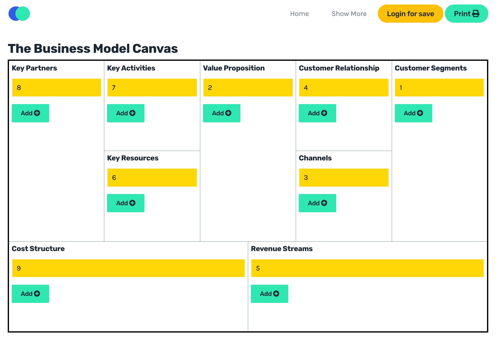

## Business Model Canvas App

## Why ?

It's cool and fun.

## Features
1. Add/Edit/Remove element
2. Drag & Drop
3. Print easily
4. Login for save
5. ...

## Requirement

You must be sure to have the following elements installed on your machine.

- [Bow Framework](https://bowphp.github.io) by [@franck_dakia](https://twitter.com/franck_dakia)
- PHP >= 7
- OpenSSL PHP Extension
- PDO PHP Extension
- Mbstring PHP Extension
- XML PHP Extension
- JSON PHP Extension

## Contact me 

If you need technical support or have any questions, please send a message to [agazinakou@gmail.com](mailto:agazinakou@gmail.com) or via skype: aziiin5.

**Don't re-invent the wheel, Just re-align It.**
