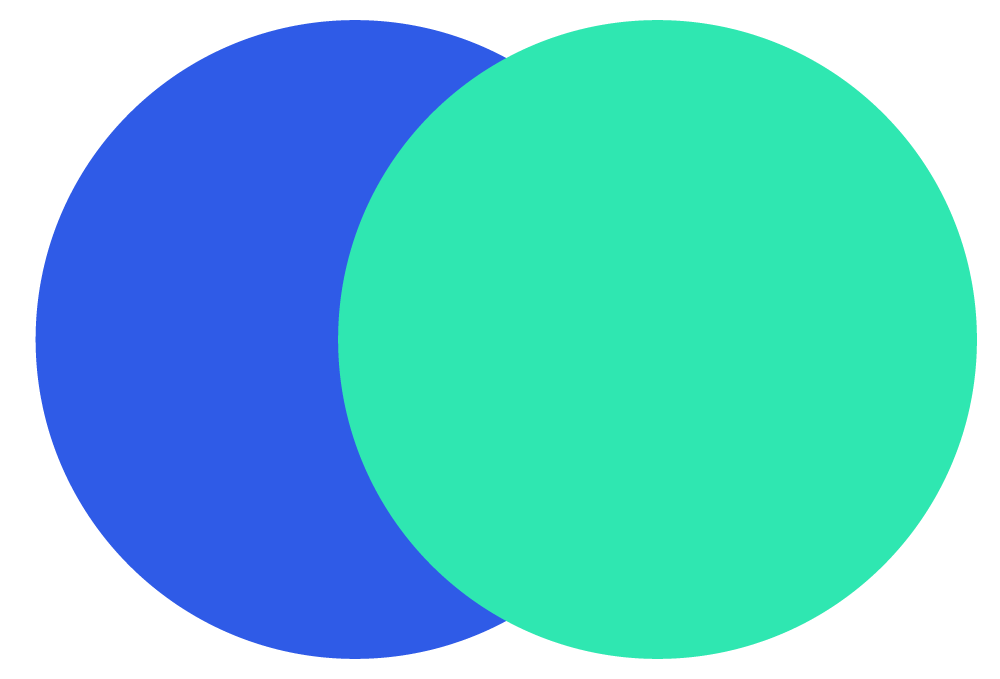

## Business Model Canvas App

## Why ?

A picture is worth a thousand words. BMC is visual!

The BMC will allow you to identify your project at a glance. Its structure, composed of 9 blocks, provides an overall vision that is lacking when writing a business plan. To understand, create your business model canvas here.

## Features
1. Add/Edit/Remove element
2. Drag & Drop
3. Print easily
4. Login for save
5. Tooltip
6. ...

## Requirement

You must be sure to have the following elements installed on your machine.

- [Bow Framework](https://bowphp.github.io) by [@franck_dakia](https://twitter.com/franck_dakia)
- PHP >= 7
- OpenSSL PHP Extension
- PDO PHP Extension
- Mbstring PHP Extension
- XML PHP Extension
- JSON PHP Extension

## Getting Help

If you have any questions or feedback, please send a message to [agazinakou@gmail.com](mailto:agazinakou@gmail.com) or via skype: aziiin5.

**Don't re-invent the wheel, Just re-align It.**
